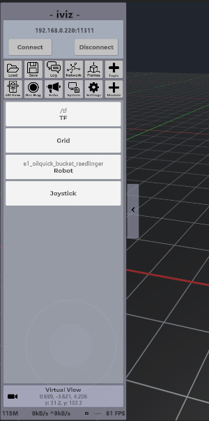
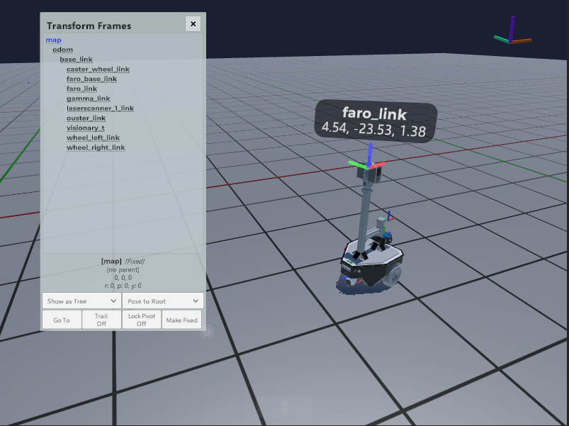
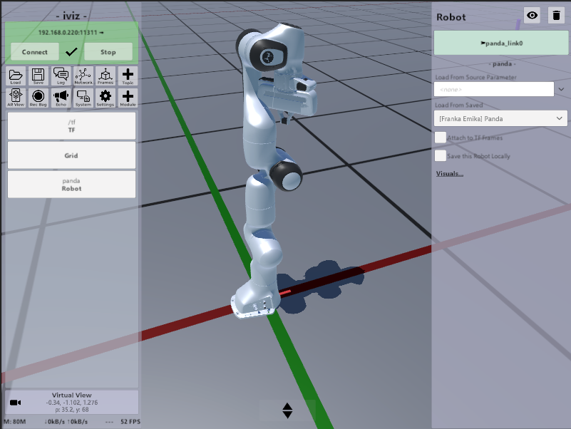
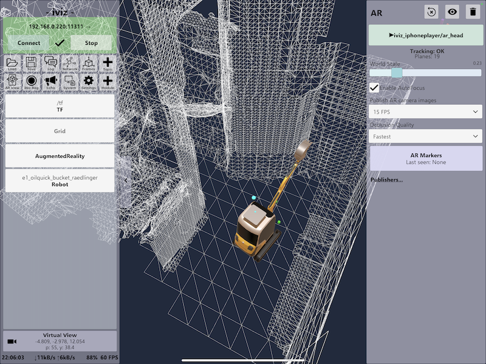

# Welcome to iviz!

**iviz** is a mobile 3D visualization app for ROS based on the Unity Engine.
You can use it to display 3D information about topics, navigate your virtual environment, or watch your robot in Augmented Reality.

iviz has been designed primarily for use in **mobile devices** (iOS/Android smartphones and tablets), but can also be used in a normal PC if you don't mind the big buttons.

If you want a technical overview or want to cite this app, you can read the [publication here](
https://doi.org/10.1016/j.simpa.2021.100057) (open access!).


## 1. Installation

To run iviz, you need the following:
* For mobile: iOS (> 11.0) or Android (> 7.0)
* For the standalone package: Windows, Linux, or macOS
* For running from the editor: Unity 2021.3

The Unity project has no external dependencies (all required libraries are included), so installing it is just a matter of cloning the repository, launching Unity, and selecting the scene at 'Scenes/UI AR'.

## 2. Getting Started

Here are some instructions on how to get started:

### Connect to the ROS master

* On the panel at the top-left, right underneath the "- iviz -" label, tap on the address in bold with the arrow at the end.

* You should now see the **Connection Dialog**.
    - In **Master URI** write the URL of the master, i.e., where roscore is running. This is the content usually stored in the environment variable _ROS_MASTER_URI_.
        * The arrow icon will show you previously used masters.
    - Optional: In **My Caller URI** write the URL you want for your device. The URL should have the form http://_hostname_:port/
        * Your hostname is the content usually stored in _ROS_HOSTNAME_ or _ROS_IP_.
        * The port (7613) can be set to anything, just make sure it's not being used by another application.
        * The hostname and port should be accessible to the ROS nodes that you want to contact. Do not use something like http://localhost:7613, as this will cause other computers to try to connect to themselves instead of you.
    - Optional: In **My ID** write your ROS id. This is the name of your ROS node. It can be anything, but make sure it is unique in your network.
* Now tap on the **Connect** button. The application will try to connect to the ROS master, and keep retrying if it does not work. Tap **Stop** to cancel the operation.
* Once you have connected, the top-left panel should become green. You can now add modules such as topic listeners, robots, watch the TF frames, and so on.


### Navigation

To move around:
* On a mobile device: Tap with one finger and drag to rotate the camera. Tap with two fingers and move to translate the camera. Pinch to zoom in and out.
* On a PC: Hold down the right mouse button and move the mouse to rotate the camera. While holding the right button down, press W-A-S-D or Q-E to translate the camera. (This is the same behaviour as in Unity)

The axis frame at the top-right tell you the current orientation of the camera (red is +X, green is +Y, purple is +Z) in relation to the fixed frame.
If you get lost, you can click on the TF button on the left, and then click on the frame panel on the top right (the green one).
It will take you back to the map frame, positioned on the origin - or whatever frame you chose as the fixed frame.
Many modules also have frame panels in green, you can click them to go to where the module is centered.

If the frame referenced by the frame panel is moving, you can click and drag the frame panel to the left (into the screen) to **Lock the Camera** onto it.
You will now follow the frame whenever it moves.
Click on the lock on the bottom of the screen to restore the camera.

### Adding Modules

In iviz, modules are entities that display visual data, usually from ROS streams. 
They are represented by the rectangular buttons on the left side, right below the two rows of dialog buttons.
When you start iviz, two modules are started by default: TF (in charge of the transform frames) and Grid (the floor plane).
All modules except TF can also be removed.

In order to add a module for a ROS topic, click on the **+ Topic** dialog.
You will be shown a list of available topics you can add.
* **Show Unsupported**: Select this to show all the topics, even the ones that cannot be visualized by iviz.
* **Sort by Type**: Sorts the topics by type. Otherwise they are sorted by topic name.


<!--
These include:
* **Augmented Reality**: The AR manager (more in Section 11).
* **Robot**: Displays a robot (more in Section 10).
* **DepthCloud**: Transforms a depth image (optionally with a color image) into a point cloud.
* **Joystick**: Displays two on-screen joysticks that publish twist messages.
* **Grid**: Creates a new grid.
-->

Helpful Notes:
* If you just want to see the a plain list of every topic and service, use the **System** dialog.
* You can find additional debugging messages (from iviz and other nodes) in the Console **Log** dialog.
* If you're only interested in listening to the messages in a topic, but not visualizing them, you can use the **Echo** dialog.

Other modules that are not related to topics can be found by clicking on the **+ Module** button.

In order to remove a module, select the module and then on the trash button on the top right.
Alternatively, you can click on the module button and drag it to the left, away from the screen.

### Connections

At each module that involves a ROS connection, you will see light-blue panels showing the ROS topic and statistics.
These are called the **Listener Widgets**.
An example can be found by clicking on the TF module.
Cyan panels appear on top and represent listeners.
Right below the topic, you will see statistics in the form of
* Num Publishers | Messages per Second | KBytes per Second

The number of publishers is a pair A/B, where A is the number of connections, and B is the number of nodes that are advertising the topic.
If A is not equal to B, then there is at least one node that iviz could not connect to.
This may be because the node is offline and forgot to unadvertise itself.
However, if you think there is a network problem, check out the  **Network** dialog.
It shows a summary of all connections the app is managing, together with the name of the nodes it is connected to (and those it failed to connect with).


A **Listener Widget** can be paused by clicking on it.
You can unpause it by clicking it again.
Sometimes, iviz will not be able to connect to a publisher, showing '0/X' even if a publisher is available.
In this case, a quick solution is to 'reset' the listener by pausing and unpausing it.
If this doesn't work, check the **Network** dialog for more information, or the **Log** dialog for to see if any node has complained.

In some data panels, on the bottom in darker blue, are **Publisher Widgets** showing similar information.

### Connection Troubleshooting

If you are having trouble with connections, you can try the following:

* The **Network** dialog contains information about which nodes iviz is connected to. 
If the app is trying to connect to a node and failing, this dialog can give an idea of why it's happening.


* In ROS networks **DNS resolving** is very important, as we need to know which IP correspond to which hostname.
As some networks are improvised, it is often required to put these entries in /etc/hosts, which may not exist in a mobile device.
To address this, you can use the **Aliases** tab in the **System** dialog.
For example, the previous picture has a node called 'telepresence-virtualbox', whose IP we add as follows.


* If you are able to listen to other nodes publishing messages, but all of your iviz publishers show zero subscribers, then there may be a firewall problem preventing incoming connections.
Or maybe the hostname you gave in **My Caller Uri** is not reachable.


### Settings

Finally, one option you should check out is the **Settings** dialog (the button with the gear icon).
It presents multiple options that control the quality and CPU usage of the application.
You can get an idea of how much resources iviz is using by checking the FPS value on the left panel, at the bottom.
You can set the maximum FPS at 60 if you want a fluid display, but you may also need to lower the graphics quality. 
The CPU usage can also be reduced by lowering the frequency at which network data is being processed.
The Settings configuration is saved automatically, and will be reused the next time iviz is started.


## 2. Panels and Dialogs

On the left side, below the Connect panel, you will find a panel with two rows of buttons, the **Dialog Panel**.
Clicking on them will open the corresponding dialog in the center of the screen.

Below it is the **Module Panel**.
It shows the active dialogs as large square buttons.
For example, the TF module is always present.
Clicking a module will open the **Data Panel** on the right, showing information for that module.
Clicking the button again will close it.
You can drag a button to the right (into the screen) to make it invisible in the world.
You can drag it to the left (away from the screen) to destroy it - but be careful with it!

Deep below the **Module Panel** is the **Camera Panel**.
It tells you which view you are in (Virtual View / AR View / whatever).
Below it is the current camera position in relation to the fixed frame.
And finally, the panel also gives you the **p**itch and the **y**aw of the rotation.

The last line contains basic statistics about the program.
On PC, it will list the used memory, the current bandwidth, the battery (if available) and the frame rate.
On mobile, it will show the clock instead of the used memory.

You can hide the GUI by pressing the **Hide GUI** button with the arrows: in PCs it is located at the center bottom, while on mobile it is located on the left side, next to the __Module Panel__.  
Once the GUI is hidden, the button becomes semitransparent, and you can click it back to reopen the GUI.



### Detachable Dialogs


## 6. Working with Transform Frames

The TF module automatically subscribes itself to /tf and /tf_static when the client is connected, and will by default display every transformation frame.
iviz does not enforce a unique root frame, and all frames without parents are assumed to be on the 'origin'.
On panels that deal with transform frames, there is a green panel showing the latest frame referenced by a message header.
You can click on it to move the camera to that frame.

Of interest when working with frames are two modules:
First, the **TF** module is in charge of displaying transform frames. It contains the following widgets:
* **Visible**: Click on the eye on the top right to show or hide the frames.
* **Reset**: Click on the circle on the top right to remove all frames. 
Note: if a frame is being used by another module, iviz will retain it and its parents.
* **Keep All Frames, Even if Unused**: If deactivated, it will remove all frames that do not have a module attached to them. 
This is similar to a permanent **Reset**, that is, iviz will not add new frames unless a module starts using it.  
* **Show Frame Names**: Displays a text next to the frame with their names.
* **Connect Children to Parents**: Displays lines that connect a child frame to their parent.
* **Frame Size**: The size of the frame in meters.  

Second, the **Transform Frames Dialog** can be accessed by clicking on the **Frames** button on the left panel. 
It shows a list of all frames in the scene.
When you click on a frame name, it will show you information about it:
* The frame name (in bold).
* The parent frame.
* The position.
* The rotation in roll-pitch-yaw.

The following widgets control how the information of the selected frame is shown:
* **Show as Tree/Show as Root**: Shows how the frames from the scene are displayed in the list.
* **Pose to Root/Relative to Parent/Relative to Fixed**: Controls how the position and rotation are displayed.

Below that:
* **Go To**: Moves the camera to that frame, similar to clicking on the green frame of a module.
* **Trail: On/Off**: Enables or disables a 5 second trail that follows the movement of the frame.
* **Lock Pivot: On/Off**: Enables or disables the lock pivot navigation.
When active, the only movement allowed is rotation around the frame.
You can zoom in and out by moving forward or backwards.
The camera will follow the frame as it moves.
Once active, an unlock button will appear on the lower part of the screen which can be clicked to deactivate it.
* **Make Fixed**: This will put the frame at the origin of the scene.
If the frame is transformed, iviz will apply the inverse of the transform to the world instead.
This is useful in AR mode when you want to 'teleport' the scene to a different place, or just to keep the camera on top of a moving robot.
Furthermore, events such as clicks on the grid will be published based on this frame.
The fixed frame will be shown in green.


Two more things:
* The **Transform Frames Dialog** is an example of a **Detachable Dialog**.
In order to detach it, just tap on the title and drag it away from the center.
Once a dialog is detached, it will slightly change color, and a small circle will appear on the bottom right.
You can use this circle to resize the dialog.
Detached dialogs will always be visible, even if you hide the GUI.
Close the dialog to restore it to its normal function.
* The **frame displays** (the axes with red-green-blue) are **highlightable**, that is, they can be right-clicked/tapped to show more information about them.
You can use use this to know the name of the frame without having to make all frames visible.
The grid is also highlightable, and you can right-click it to see which point you just clicked.
All positions are in relation to the fixed frame.



**Limitations**: Because iviz uses the Unity transform system as the backend for TF, you will have trouble working with coordinates that are extremely large in value (>10000).
This is because 32-bit floats have low resolution in those ranges (ROS TF works with doubles), usually causing 3D models to be rendered incorrectly.
For this reason, TF messages with large values will be ignored.
This can make it difficult to work with scenarios that depend on UTM coordinates.
A workaround for this is to use a child of the UTM frame as the fixed frame.

  
## 7. Log Dialog

The **Console Log Dialog** is a detachable dialog in charge of presenting messages of iviz and other nodes sent to /rosout.
It has two widgets:
* **From**:  This limits whose messages will be printed. You can choose between _[All]_, _[None]_, _[Me]_, or a specific node.
* **Log Level**: This sets the lowest message level to be displayed (such as Debug, Info, Warning, etc.). 


## 8. Echo Dialog

The **Echo Dialog** can be used to display messages from any topic.
If iviz does not know the message, it will try to reconstruct the definitition based on information exchanged in the handshake.
Arrays and long strings will be shortened to keep the GUI from being overflowed.

It has two widgets:
* **Pause** (top right): Use this to pause/unpause the listener.
* **Topic**: Use this to select the topic, or (None) to cancel.


Note that closing the window will leave the subscriber open (and will continue to consume bandwidth).
If this is not desired, simply select (None) as the topic.

## 9. Image Streams

## 9. Model Loader Service and External Models

When working with robots and markers, you will often need to work with 3D assets stored in external files, and probably on a different PC.
This is problematic with iviz, as you will usually want to run it on an mobile device or on a PC without a ROS installation.
Instead of copying the files manually, you can simply use the model service node on the PC, which iviz will detect and use automatically whenever an asset file is requested.

There are three ways to enable the model service:
1) It will most likely be that your roscore and the assets are running on a 64-bit Linux PC.
In that case, either check-out the iviz sources in that PC, or copy the _iviz_model_service/Binaries_ folder from an existing installation there.
Within it, you can run the precompiled binary _Iviz.ModelService_.
It will look something like this:

  
2) Clone the iviz sources on the PC with ROS installation and the assets, and make sure you have the NET 5.0 SDK installed.
Then, run the following command on the GIT root folder (/iviz, but not /iviz/iviz):
```bash
dotnet iviz_model_service/Publish/Iviz.ModelService.dll
```
3) Start *iviz* on the PC with the assets and enable the model service on the **Settings** menu.
   (Note that if the PC with the assets is not the same as the PC running the visualization, then you would need **two** iviz instances running.
   Make sure that the ROS id of both instances are different.) 

Note that the model service can only be started on a PC (Linux, Windows, macOS), and is disabled in mobile.
  

## 10. Working with Robots

You can add a robot by opening the **+ Module** dialog, and then selecting the **Robot** option.
The new robot module will be empty. 
There are two ways to setup a robot:
* **Load From Source Parameter:** This downloads a URDF from the parameter server. 
  You can write any parameter name you like, or select a parameter from the suggestions (i.e., all entries that include the text 'robot_description').
* **Load From Saved:** This adds a robot from a list included by default in iviz.

Other options include:
* **Hide**: Use the eye button on the top-middle to hide the robot or make it visible again. 
* **Trash**: The trash button on the top-right deletes the robot.
* **Frame**: The widget in green shows the name of the base link frame. Click on it to focus the camera there. 
Drag it to the left to follow the robot.
ww* **Attach to TF Frames:** By default the robot only listens to the frame that corresponds to the base link.
Enable this to read the TF frames for all links. If you see the robot crumple onto the floor, then the TF frames have not been set.
* **Save this Robot Locally:** Saves a copy of the robot on the device. The robot can then be loaded from the **Load From Saved** menu.

Hidden within the **Visuals...** collapsible are more options:
* **AR Occlusion Only Mode:** This tells the shader to only write the depth values of the robot, but not the color.
  In essence, this 'punches' a hole in the scene, showing the background where the robot should be.
  This is useful in Augmented Reality when you have a digital twin of the robot at the exact same position as the real robot.
  Then, by enabling this, you can hide virtual objects that are behind the real robot, while leaving objects in front of the robot intact.
* **Tint:** This changes the color of the robot. Click on the colored rectangle to change to HSV.
* **Alpha:** Sets the transparency of the robot.
* **Metallic:** Sets the metallic property of the robot shader. This controls how reflective the robot is.
* **Smoothness:** Sets the smoothness property of the robot shader. This indicates how 'polished' the robot's surface is.




**Note:** If you're downloading a URDF from the parameter server, you will most likely also need 3D assets such as meshes and textures.
So unless your robot consists only of cubes and cylinders, it will be necessary to start the **Model Service** (Section 9).

### Troubleshooting
* The robot doesn't move, but the frames do
  * Enable 'Attach to TF Frames'.
* There is an error message saying 'provider not found'
  * You need an external asset, but there is no Model Service active in the system. See Section 9.
* There is an error message saying 'Failed to find resource path XXX' or 'Failed to find package XXX'
  * The model service is running, but could not find the requested file. 
    Make sure that the model service node is running in the same PC as the assets, and that the root folder of the ROS package is in ros_package_path.
* There is an error message simply saying 'Failed to retrieve XXX'
  * This happens if retrieving a file fails multiple times. The original error should appear a little higher.

## 11. Markers

## 12. Loading and Saving


## 13. Working with Augmented Reality
To enable Augmented Reality (AR), go to the left panel and click the **AR View** button.
Alternatively, you can click the **+ Module** button and then choose _Augmented Reality_.
You will need an AR-capable device (tablet or smartphone) for this.

Once the AR module is active, the usual **Virtual View** visualization is replaced with the **AR View**.
Now, you need to setup the AR mode.
* First, you need to let your device find a plane on which the AR view will be displayed. 
  This is achieved by moving the device laterally (_not_ by rotating it).
  Only by translating your device can the AR system find the 3D location of its point features and estimate a plane from them.
  (Newer devices with depth cameras will find a plane almost instantly.) 
* Once a plane is found, the transparent frame becomes opaque, and the _Start_ button becomes available.
* When you find an appropriate origin, click on _Start_.
  Your scene should now become visible.
* **Note:** If the image appears too grainy, or iviz takes too long to find a plane, you can try moving to a more illuminated place, or adding more light to your scene.

Once you start the AR visualization, pay attention to the FPS counter (left panel, at the bottom).
Depending on the device, it should be either 30 or 60.
If your FPS is lower than expected, you should try lowering the graphics quality (**Settings** dialog, gears button on the left panel).
It is not a good idea to have the AR tracking system compete with the visualization for CPU.

You should now see something like this (minus the robot):


On the left part there is a toolbar with multiple buttons:
* **Toggle**: This will switch between the **AR View** and the **Virtual View**.
* **Mover**: This presents a menu that allows you to move the origin. Red is X, Green is Y, Blue is Z, and White is Yaw Rotation.
  It has two modalities:
    * Global: Here, X, Y, Z, and Yaw are in the coordinate system of the origin. X is right, Y is front, and Z is up.
    * Screen: Here the directions are in the coordinate system of the screen, and change depending on how your screen is oriented.
      X is to the right of the device, Y is forwards into the screen, and Z points upwards.
      Yaw rotates the world around ~1 meter in front of the device.
* **Meshing**: If your device can reconstruct the environment, this activates or deactivates it. 
* **TF**: This provides easy access to some TF options.
* **Reposition**: This tells iviz to restart the AR setup mode. Use this if you moved some distance from the origin and want to reposition it to be wherever you are now. 
* **Reset All**: This restarts the AR system. Use this if something goes wrong.

There is also a long vertical grey bar. Press this in order to hide the toolbar.
The button with the arrow will show the main GUI again.
It should look like this (minus the robot):



This image shows the **Virtual View** of the same scene.
On devices that support meshing, you will see the reconstructed mesh of your surroundings.
On the right, you will see the contents of the **Augmented Reality** module, with the following options:
* **Trash**: This disables the AR system.
* **Frame Widget**: Shows the fixed TF frame used for the AR origin.
* **Status Label**: Shows diagnostic data about the AR system, including the tracking state and the number of detected planes.
* **World Scale**: This allows you to make the virtual world smaller or bigger. Useful when visualizing large robots such as cars on a small table.
* **Enable Auto Focus**: If the device keeps refocusing all the time making the scene blurry, you can try disabling this.
* **Publish AR camera images**: The AR module advertises topics which publish the color and depth images from the device if a node is suscribed.
Use these if you want to capture data from your device into another application.
* **Occlusion Quality**: This enables the Depth API present in newer devices that can hide a virtual object if it is located behind a real-world object.
* **AR Markers**: (iPad only - to be written)


## 14. Credits

The code of iviz is open-source and released under the MIT license. 
This work is part of the ROBDEKON project (https://robdekon.de) and is financed by the German Federal Ministry of Education and Research (BMBF).


