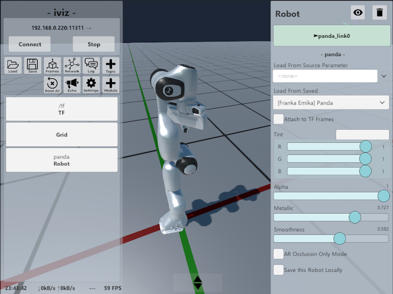

# Welcome to iviz!

**iviz** is a mobile 3D visualization app for ROS based on the Unity Engine.
You can use it to display 3D information about topics, navigate your virtual environment, or watch your robot in Augmented Reality.

iviz has been designed primarily for use in **mobile devices** (iOS/Android smartphones and tablets), but can also be used in a normal PC if you don't mind the big buttons.


## 1. Installation

To run iviz, you need the following:
* Unity 2019.4 LTS on either Windows, Linux, or macOS
* For mobile: iOS (> 11.0) or Android (> 7.0)

The iviz project has no external dependencies (all required libraries are included), so installing it is just a matter of cloning the repository, launching Unity, and selecting the scene at 'Scenes/UI AR'.

If you have Android, there is an APK in the [Binaries](Binaries/android) folder.

## 2. Getting Started

Here are some instructions on how to get started:

* (If using Unity) Start Unity 2019.4, and open the project on the iviz folder. Make sure that the scene **Scenes/UI AR** is active. Press Play.
* On the panel at the top-left, right underneath the "- iviz -" label, tap on the address with the arrow at the end.

* You should now see the **Connection Dialog**.
  - In **Master URL** write the URL of the master, i.e., where roscore is running. This is the content usually stored in the environment variable _ROS_MASTER_URI_.
    * The arrow icon will show you previously used masters.
  - Optional: In **My URL** write the URL you want for your device. The URL should have the form http://_hostname_:port/
    * The hostname is the content usually stored in _ROS_HOSTNAME_ or _ROS_IP_. 
    * The port (7613) can be set to anything, just make sure it's not being used by another application.
    * The hostname and port should be accessible to the ROS nodes that you want to contact. This is important for devices that are in multiple networks.
    * Note that the hostname and port will be sent 'as is' to other ROS nodes. For example, if you use something like http://localhost:7613, other computers will try to connect to themselves instead of you.
    * The arrow icon will show a list of example URLs based on the addresses of your device. 
  - Optional: In **My ID** write your ROS id. This is the name of your ROS node. It can be anything, but make sure it is unique in your network.
* Once the data is correct, tap on the **Connect** button. The application will now try to connect to the ROS master, and keep retrying if it does not work. Tap **Stop** to cancel the operation. 
* Once you have connected, the top-left panel should become green. You can now add modules such as topic listeners, robots, watch the TF frames, and so on.

You can hide the GUI with the arrows at the center-bottom. 
Once the GUI is hidden, the button becomes semitransparent, and you can click it back to reopen the GUI.

Finally, one option you should check out is the **Settings** dialog (left panel, with the gear icon).
It presents multiple options that control the quality and CPU usage of the application.
You can get an idea of how much resources iviz is using by checking the FPS value on the left panel, at the bottom.
You can set the maximum FPS at 60 if you want a fluid display, but you may also need to lower the graphics quality. 
The CPU usage can also be reduced by lowering the frequency at which network data is being processed.
Please note that the Settings configuration is saved any time it is changed, and will be reused the next time iviz is started.


## 3. Navigation

To move around:
* On a PC: Hold down the right mouse button and move the mouse to rotate the camera. While holding the right button down, press W-A-S-D to translate the camera. (This is the same behaviour as in Unity)
* On a mobile device: Tap with one finger and drag to rotate the camera. Tap with two fingers and move to translate the camera. Pinch to zoom in and out.

The lines at the top-right tell you the current orientation of the camera (red is +X, green is +Y, purple is +Z).
If you get lost, you can click on the TF button on the left, and then on the green button on the right.
It will take you back to the map frame, positioned on the origin.
Many modules also have a green frame widget, you can click it to go to where the module is centered.

## 4. Adding Topics and Modules

In order to add a module that listens to a topic, click on the *+ Topic* button.
You will be shown a list of available topics you can add.
* **Show Unsupported**: Select this to show all the topics, even the ones that cannot be displayed.    

iviz also supports some modules that are not related to topics, which can be found by clicking on the *+ Module* button.
These include:
* **Augmented Reality**: The AR manager (more in Section 11).
* **Robot**: Displays a robot (more in Section 10).
* **DepthCloud**: Transforms a depth image (optionally with a color image) into a point cloud.
* **Joystick**: Displays two on-screen joysticks that publish twist messages.
* **Grid**: Creates a new grid.

If you're only interested in listening to a topic, but not displaying it, you can press the **Echo** button (see Section 8).

## 5. Connections

At each module that involves a ROS connection, you will see light-blue panels showing the ROS topic and statistics.
Cyan panels appear on top and represent listeners. Outside of the topic, you will see statistics in the form of
* Num Publishers | Messages per Second | KBytes per Second | Num Messages Dropped

Note that the number of messages dropped are not because of the connection, but usually because only one message can be displayed at each frame.
Other modules, such as TF or Markers, can process multiple messages per frame, but the maximal amount is still capped for performance reasons.

A listener widget can be paused by clicking on it.
You can unpause it by clicking it again.
Sometimes, iviz will not be able to connect to a publisher, showing '0' even if a publisher is available.
In this case, the listener can be reset by pausing and unpausing it.
To reset all connections, click on the **Reset** button on the left panel. 

On the bottom, in darker blue, are publisher widgets, showing similar information.

To get a summary of all connections the app is managing, together with the name of the nodes it is connected to (and those it failed to connect with), you can click on the *Network* button.
Incoming connections are shown in blue, outgoing connections in red.   

## 6. Working with Transform Frames

The TF module automatically subscribes itself to /tf and /tf_static when the client is connected, and will by default display every transformation frame.
iviz does not enforce a unique fixed frame, and all frames without parents are assumed to be on the origin.
iviz will also assume that a frame named 'map' exists on the origin.
Furthermore, on panels that deal with transform frames, there is a green widget showing the latest frame referenced by a message header.
You can click on it to move the camera to that frame.

Of interest when working with frames are two modules:
First, the **TF** module is in charge of displaying transform frames. It contains the following widgets:
* **Visible**: Click on the eye on the top right to show or hide the frames.
* **Keep All Frames, Even if Unused**: If deactivated, it will remove all frames that do not have a display attached to them. 
This is useful as a soft reset, or just to keep unrelated frames from cluttering the screen.
* **Show Frame Names**: Displays a text next to the frame with their names.
* **Connect Children to Parents**: Displays lines that connect a child frame to their parent.
* **Frame Size**: The size of the frame in meters.  

If there are old static frames or unused frames that you want to get rid of, click on the ** Reset All** button on the left.

Second, the **Frame Dialog** can be accessed by clicking on the **Frame** button on the left panel. 
It shows a list of all frames in the scene, together with their absolute position (relative to the root).
When you click on a frame name, the following options become available at the bottom:
* **Go To**: Moves the camera to the frame.
* **Trail: On/Off**: Enables or disables a 5 second trail that follows the movement of the frame.
* **Lock Pivot: On/Off**: Enables or disables the lock pivot navigation.
When active, the only movement allowed is rotation around the frame.
You can zoom in and out by moving forward or backwards.
The camera will follow the frame as it moves.
Once active, an unlock button will appear on the lower part of the screen which can be clicked to deactivate it.
* **Make Fixed**: This will put the frame at the origin of the scene.
If the frame is transformed, iviz will apply the inverse of the transform to the world instead.
This is useful in AR mode when you want to 'teleport' the scene to a different place, or just to keep the camera on top of a moving robot.
Furthermore, events such as clicks on the grid will be published based on this frame.
The fixed frame will be shown in green.
  
**Limitations**: Because iviz uses the Unity transform system as the backend for TF, you will have trouble working with coordinates that are extremely large in value (>10000).
This is because 32-bit floats have low resolution in those ranges (ROS TF works with doubles), usually causing 3D models to be rendered incorrectly.
For this reason, TF messages with large values will be ignored.
This can make it difficult to work with scenarios that depend on UTM coordinates.


  
## 7. Log Dialog

The Log Dialog is in charge of presenting messages of iviz and other nodes sent to /rosout.
It has two widgets:
* **From**:  This limits whose messages will be printed. You can choose between _[All]_, _[None]_, _[Me]_, or a specific node.
* **Log Level**: This sets the lowest message level to be displayed (such as Debug, Info, Warning, etc.). 

## 8. Echo Dialog

The Echo Dialog can be used to display messages from any topic.
However, arrays and long strings will be shortened to keep the app from being overflowed.

It has a single widget:
* **Topic**: Use this to select the topic, or (None) to cancel.

Note that closing the window will leave the subscriber open (and will continue to consume bandwidth).
If this is not desired, simply select (None) as the topic.

## 9. Model Service

When working with robots and markers, you will often need to work with 3D assets stored in external files, and probably on an external PC.
This is problematic with iviz, as you will usually want to run it on an mobile device.
Instead of copying the files manually, you can simply use the model service node on the PC, which iviz will detect and use automatically whenever an asset file is requested.

There are two ways to enable the model service:
* Starting *iviz* on the PC with the assets, and enabling it on the **Settings** menu.
* Using the *iviz_model_service* app from the base iviz folder (the parent of the iviz app) using
  ```bash
  dotnet iviz_model_service/Publish/Iviz.ModelService.dll
    ```

There are two ways to run the model service:
* *Enabling the file schema*: This allows you to access any file on the PC using the 'file://' schema.
  * When using iviz as the model service, open the **Settings** menu and select _Model Service: On + File_
  * When using the model service app, call it using 
    ```bash
    dotnet iviz_model_service/Publish/Iviz.ModelService.dll --enable-file-schema
    ```
* *Enabling the package schema:* In order to use URIs with the 'package://' schema, you need to do the following:
  * When using the model service app, you simply need to have a ROS_PACKAGE_PATH configured.
  This happens by default on any ROS installation where the settings have been sourced.
  * When using _iviz_, you need to take into account that the app cannot read environment variables from inside Unity.
  So you need to tell iviz where the ROS packages are located. You can do as follows:
    1) Within your home/personal directory, create a folder called _.iviz_
    2) Create a file called simply _ros_package_path_
    3) Copy the contents of ROS_PACKAGE_PATH there.
    4) (Re-)Start the model service in the **Settings** menu. You should now see a non-zero number of packages.
  
**Note:** It is also possible to use the model service on a PC *without* ROS.
Running iviz on the PC with the 3D assets is enough.
This is convenient if you want to use iviz but you only have Windows or macOS.
For this case, the 'file://' schema can be enabled as usual from the **Settings** dialog. 
The 'package://' schema, however, still requires you to create the .iviz folder in your home folder, and the ros_package_path file inside of it.
Simply copy the ROS packages with the assets you need in any folder you want, and write the absolute path of that folder into the ros_package_path file, as text and without whitespaces.
If you want multiple entries, put them in the same line but separated by a colon ':' character.  
Note that the model service can only be started on a PC (Linux, Windows, macOS).
  

## 10. Working with Robots

You can add a robot by opening the **+ Module** dialog, and then selecting the **Robot** option.
The new robot module will be empty. 
There are two ways to setup a robot:
* **Load From Source Parameter:** This downloads a URDF from the parameter server. 
  You can write any parameter name you like, or select a parameter from the suggestions (i.e., all entries that include the text 'robot_description').
* **Load From Saved:** This adds a robot from a list included by default in iviz.

**Note:** If you're downloading a URDF from the parameter server, you will most likely also need 3D assets such as meshes and textures.
So unless your robot consists only of cubes and cylinders, it will be necessary to start the **Model Service** (Section 9) in the **Settings** dialog. 

Other options include:
* **Hide**: Use the eye button on the top-middle to hide the robot or make it visible again. 
* **Trash**: The trash button on the top-right deletes the robot.
* **Frame**: The widget in green shows the name of the base link frame. Click on it to focus the camera there.
* **Attach to TF Frames:** By default the robot only listens to the frame that corresponds to the base link.
Enable this to read the TF frames for all links. If you see the robot crumple onto the floor, then the TF frames have not been set.
* **Tint:** This changes the color of the robot. Click on the colored rectangle to change to HSV.
* **Alpha:** Sets the transparency of the robot.
* **Metallic:** Sets the metallic property of the robot shader. This controls how reflective the robot is.
* **Smoothness:** Sets the smoothness property of the robot shader. This indicates how 'polished' the robot surface is.
* **AR Occlusion Only Mode:** This tells the shader to only write the depth values of the robot, but not the color.
In essence, this 'punches' a hole in the scene, showing the background where the robot should be.
This is useful in Augmented Reality when you have a digital twin of the robot at the exact same position as the real robot. 
Then, by enabling this, you can hide virtual objects that are behind the real robot, while leaving objects in front of the robot intact.
* **Save this Robot Locally:** Saves a copy of the robot on the device. The robot can then be loaded from the **Load From Saved** menu.




## 11. Working with Augmented Reality
To enable Augmented Reality (AR), go to **+ Module** (left panel), and then choose _Augmented Reality_.
You will need an AR-capable device (tablet or smartphone) for this.

Once the AR module is active, the usual birds-eye-view visualization is replaced with the AR setup mode.
* First, you need to let your device find a plane on which the AR view will be displayed. 
  This is achieved by moving the device laterally (_not_ by rotating it).
  Only by translating your device can the AR system find the 3D location of its point features and estimate a plane from them.
* Once a plane is found, the transparent frame becomes opaque, and the _Start_ button becomes available.
* When you find an appropriate origin, click on _Start_.
  Your scene should now become visible.
* **Note:** If the image appears too grainy, or iviz takes too long to find a plane, you can try moving to a more illuminated place, or adding more light to your scene.

Once you start the AR visualization, pay attention to the FPS counter (left panel, at the bottom).
Depending on the device, it should be either 30 or 60.
If your FPS is lower than expected, you should try lowering the graphics quality (**Settings** dialog, gears button on the left panel).
It is not a good idea to have the AR tracking system compete with the visualization for CPU.

The GUI of the AR module consists of two parts. First, the buttons on the lower part:
* **+ Marker**: This presents a menu that allows you to move the origin (red is X, green is Y, blue is Z, white is Yaw).
It has two modalities:
  * Global: Here, X, Y, Z, and Yaw are in the coordinate system of the origin. X is right, Y is front, and Z is up.  
  * Screen: Here the directions are in the coordinate system of the screen, and change depending on how your screen is oriented.
  X is to the right of the device, Y is upwards on the screen, and Z points towards the back of the device.
    Yaw rotates around the device.
* **Pin Down**: As the AR system learns more about the environment, it may find that the plane below the origin is slightly more upwards or downwards than it thought.
Enable this to make the origin follow the plane as it moves.
* **Reset**: Click this to go back to the AR setup mode.

On the panel to the left you can find the **Augmented Reality** module.
Clicking it presents the following options:
* **Hide**: The eye button on the top middle allows you to go back to the birds-eye-view mode _without_ disabling AR.
Click it again to go back to the AR view.
* **Trash**: This disables the AR system.
* **Frame Widget**: Shows the fixed TF frame used for the AR origin.
* **Info Label**: Shows diagnostic data about the AR system.
* **World Scale**: This allows you to make the world smaller. Useful when visualizing large robots such as cars on a small table.
* **Occlusion Quality**: This enables the Depth APIs present in some devices that can hide a virtual object if it is located behind a real-world object.
    

## 12. Credits

The code of iviz is open-source and released under the MIT license. 
This work is part of the ROBDEKON project (https://robdekon.de) and is financed by the German Federal Ministry of Education and Research (BMBF).


